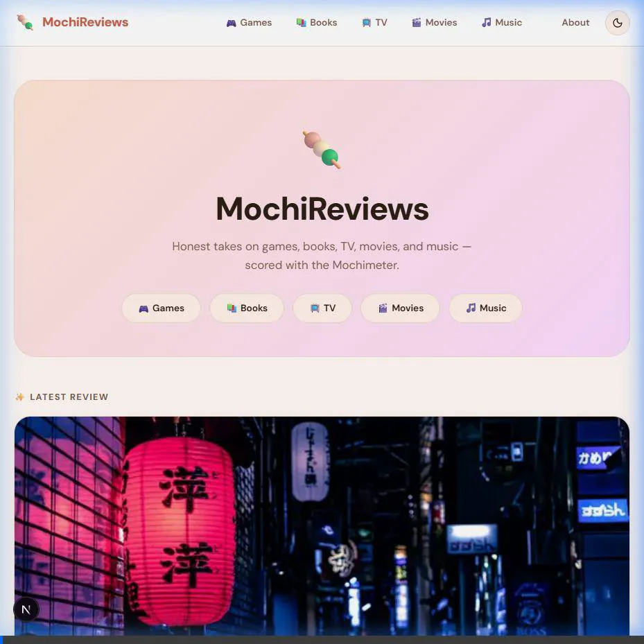
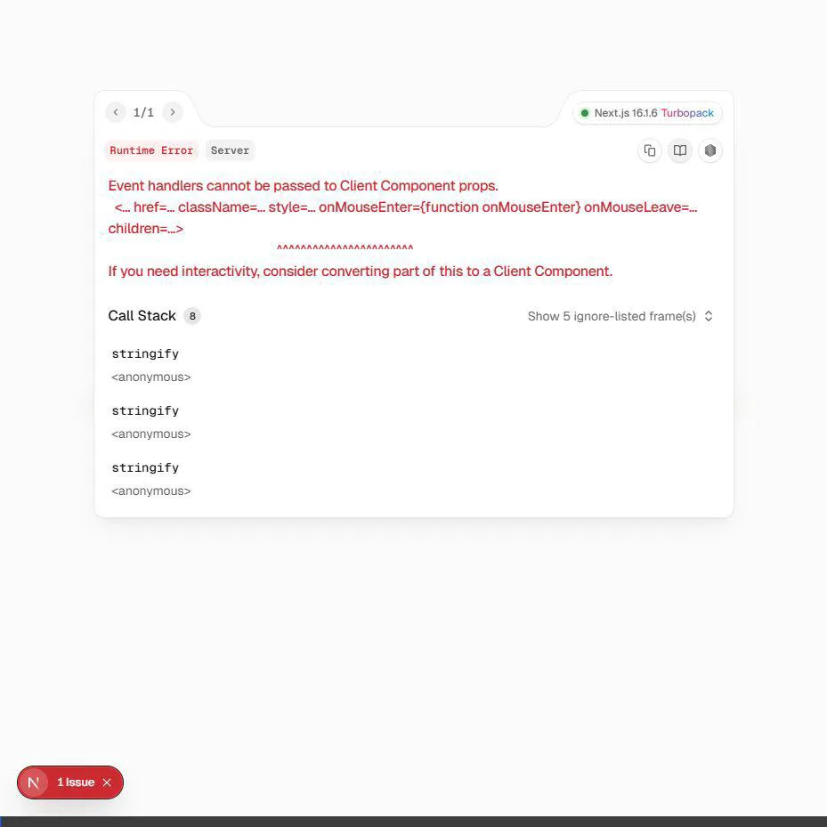

<div align="center">


# 🍡 MochiReviews

**A personal entertainment review blog — rated with mochi.**

Reviews on video games, books, TV shows, movies, and music albums. Scored with a custom Mochimeter instead of stars.

[](https://nextjs.org)
[](https://www.typescriptlang.org)
[](https://www.npmjs.com/package/better-sqlite3)
[](https://tailwindcss.com)
[](LICENSE)

[Live Demo](#) · [Admin Login](#admin-dashboard) · [Features](#features)

</div>

---

## ✨ Features

- 🍡 **Mochimeter** — a custom 10-point scoring system built with SVG mochi blobs instead of plain stars
- 🌙 **Light & Dark Mode** — persisted in localStorage, respects system preference
- 📝 **Rich-Text Editor** — Tiptap-powered editor with headings, blockquotes, lists, links, and more
- 🖼️ **Image Upload or URL** — upload images directly from disk (drag & drop) or paste a URL
- 🏷️ **Custom Categories** — 5 built-in categories + create your own (Anime, Manga, Podcast…)
- 🔐 **Protected Admin Dashboard** — password-based session auth, no database of users needed
- 📱 **Fully Responsive** — mobile drawer navigation, responsive grid layouts
- ⚡ **Material You Design** — inspired by Google Pixel UI (MD3) with warm pastels, pill buttons, rounded cards, and zero blue

---

## 📸 Screenshots

### Homepage — Light Mode
> Hero section with category pills and the latest review card featuring the Mochimeter score



### Admin Dashboard & Post Editor
> Hidden admin panel at `/admin/login` with post list management and a full rich-text editor



---

## 🗂️ Review Categories

| Category | Emoji |
|---|---|
| Video Games | 🎮 |
| Books | 📚 |
| TV Shows | 📺 |
| Movies | 🎬 |
| Music Albums | 🎵 |
| Custom (any) | 📝 |

---

## 🍡 The Mochimeter

Scores run **0.0 – 10.0** in half-point steps, visualized as a row of 10 SVG mochi blobs:

| Score | Rating |
|---|---|
| 9.0 – 10.0 | Essential |
| 7.0 – 8.5 | Recommended |
| 5.0 – 6.5 | Decent |
| 0.0 – 4.5 | Skip it |

Each blob is:
- 🟠 **Filled** — full point
- 🔶 **Half-filled** — 0.5 point  
- ⚪ **Empty** — 0 point
- Full blobs have a little face 🥰

---

## 🛠️ Tech Stack

| Layer | Technology |
|---|---|
| Framework | Next.js 16 (App Router, Turbopack) |
| Language | TypeScript |
| Styling | Tailwind CSS + CSS Custom Properties |
| Database | SQLite via `better-sqlite3` |
| Auth | `iron-session` (cookie-based) |
| Editor | Tiptap (ProseMirror) |
| Font | DM Sans (Google Fonts) |
| Icons | Lucide React |

---

## 🚀 Getting Started

### Prerequisites
- Node.js 20+
- npm

### Installation

```bash
# Clone the repo
git clone https://github.com/Aakashnath645/MochiReviews.git
cd MochiReviews

# Install dependencies
npm install

# Set up environment variables
cp .env.example .env.local
# Edit .env.local and set ADMIN_PASSWORD and SESSION_SECRET
```

### Environment Variables

Create a `.env.local` file in the project root:

```env
ADMIN_PASSWORD=your-secure-password
SESSION_SECRET=your-random-secret-at-least-32-characters-long
```

### Seed the Database

```bash
# Adds a sample Japanese detective novel review to test the layout
npx tsx lib/seed.ts
```

### Run Locally

```bash
npm run dev
# → http://localhost:3000
```

---

## 🔐 Admin Dashboard

The admin panel is intentionally unlisted — no link to it appears on the public site.

| | |
|---|---|
| **URL** | `http://localhost:3000/admin/login` |
| **Password** | Set via `ADMIN_PASSWORD` in `.env.local` |

From the dashboard you can:
- ✏️ Create and edit posts with the rich-text editor
- 🖼️ Upload cover images or use a URL
- 🏷️ Assign a category (built-in or custom)
- 🍡 Set the Mochimeter score with a live preview slider
- 📤 Publish or save as draft
- 🗑️ Delete posts

---

## 📁 Project Structure

```
MochiReviews/
├── app/
│   ├── layout.tsx              # Root layout (DM Sans + ThemeProvider)
│   ├── page.tsx                # Homepage
│   ├── posts/[slug]/page.tsx   # Post detail
│   ├── category/[slug]/page.tsx
│   ├── about/page.tsx
│   └── admin/                  # Protected section
│       ├── login/page.tsx
│       ├── page.tsx            # Dashboard
│       └── posts/new/, [id]/edit/
├── components/
│   ├── Mochimeter.tsx          # ← Custom SVG scoring UI
│   ├── PostCard.tsx
│   ├── Navbar.tsx
│   ├── ThemeProvider.tsx
│   └── editor/
│       ├── TiptapEditor.tsx
│       └── PostForm.tsx
├── lib/
│   ├── db.ts                   # SQLite singleton + CRUD
│   ├── session.ts              # iron-session config
│   ├── seed.ts                 # Sample data seed script
│   └── utils.ts
├── app/api/
│   ├── posts/                  # Public routes
│   ├── admin/posts/            # Admin CRUD
│   ├── auth/login|logout/      # Auth routes
│   └── upload/                 # Image upload handler
├── middleware.ts               # Auth guard for /admin/*
└── data/mochi.db               # SQLite file (git-ignored)
```

---

## 🎨 Design System

- **Color Palette**: Warm cream backgrounds, terracotta peach primary, matcha green secondary, soft mauve accent — **zero blue anywhere**
- **Shape language**: Rounded cards (`border-radius: 24px`), pill buttons, generous padding
- **Theming**: CSS custom properties (`--color-*`) swap between light and dark via `data-theme` on `<html>`
- **Typography**: DM Sans, weights 400–800, applied universally

---

## 📝 License

MIT © [Aakashnath645](https://github.com/Aakashnath645)
